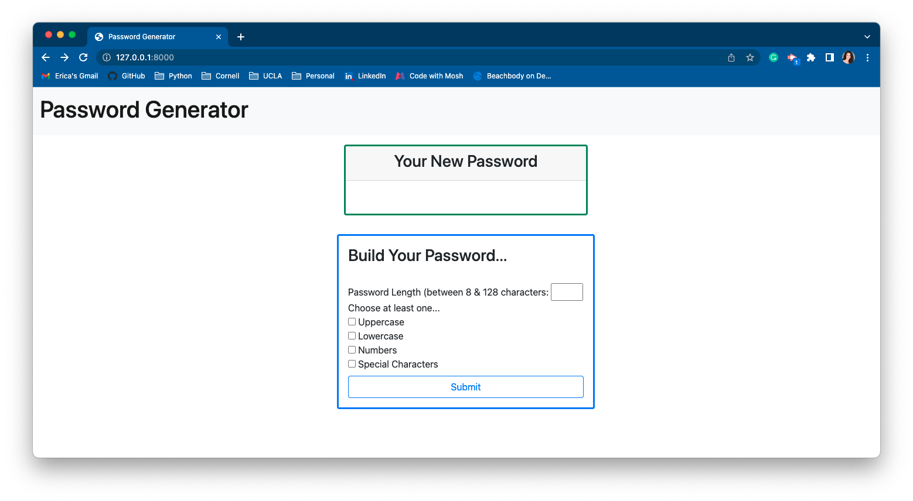
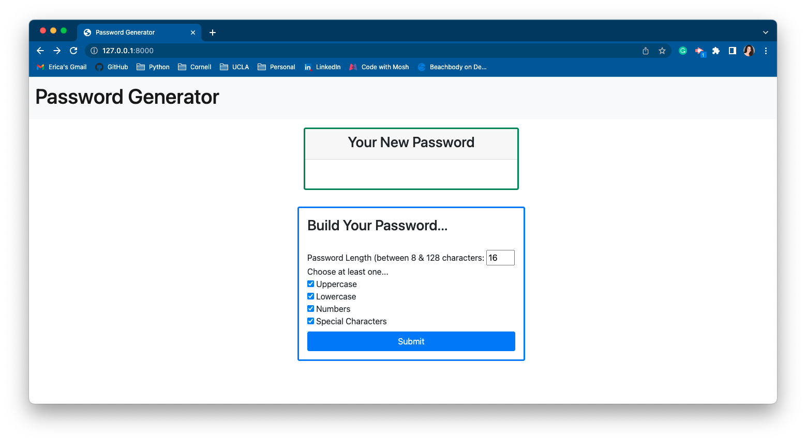
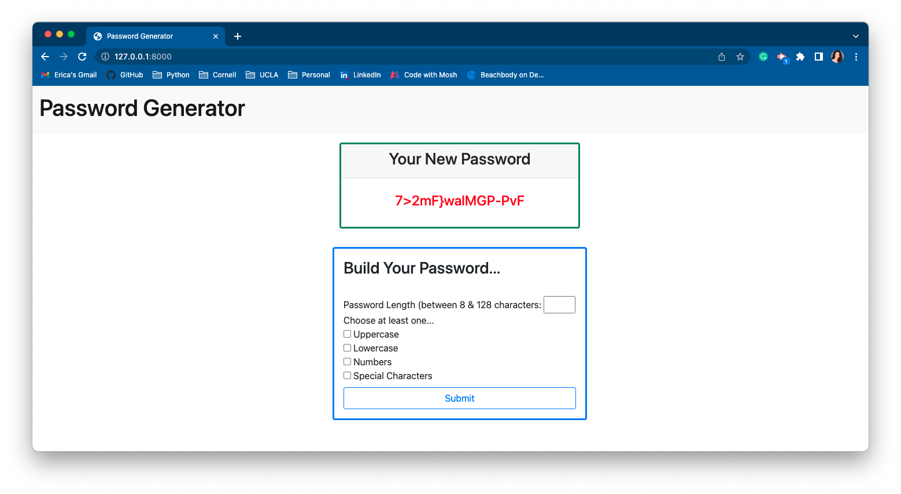

# Python Password Generator

**Based off of the Password Generator designed by UCLA Extension for the Full Stack Web Development Coding Bootcamp**

## Credit
[UCLA Full Stack Web Development Coding Boot Camp](https://www.uclaextension.edu/digital-technology/programming/course/full-stack-web-development-coding-boot-camp-com-sci-900001)

## Goal
I want to re-create the programs and apps I made during my time with the UCLA Extension bootcamp and build them with Python code. By doing this, my goal is to become proficient in building apps with Python.

## Table of Contents
- [Credit](#credit)
- [Goal](#goal)
- [Description](#description)
- [Links](#links)
- [Usage](#usage)
- [Roadmap](#roadmap)
- [Technologies](#technologies)
- [Languages](#languages)
- [Screenshots](#screenshots)

## Description
This Password Generator uses Django and Python to create a unique password based off specifications made by the user.

## Links
[Python Password Generator Deployed Page](https://python-password-generator.herokuapp.com/)

[Python Password Generator GitHub](https://github.com/ericasiegel/password-generator-py.git)

## Usage
The user will use the form to generate a unique password. They will select the length of the password (between 8 and 128 characters), and then select if they want it to contain uppercase or lowercase letters, numbers, and/or special characters. When the form is submitted, their unique password would be displayed at the top.

## Roadmap
- Add a copy to clipboard button
- Fix css for mobile use

## Technologies & Languages
- [Python](https://www.python.org/)
- [Django](https://www.djangoproject.com/)
- [Bootstrap](https://getbootstrap.com/)

## Languages
Python, Django, HTML, Bootstrap CSS

## Screenshots
    
### Main Page

### Filled Out Form

### Generated Password
